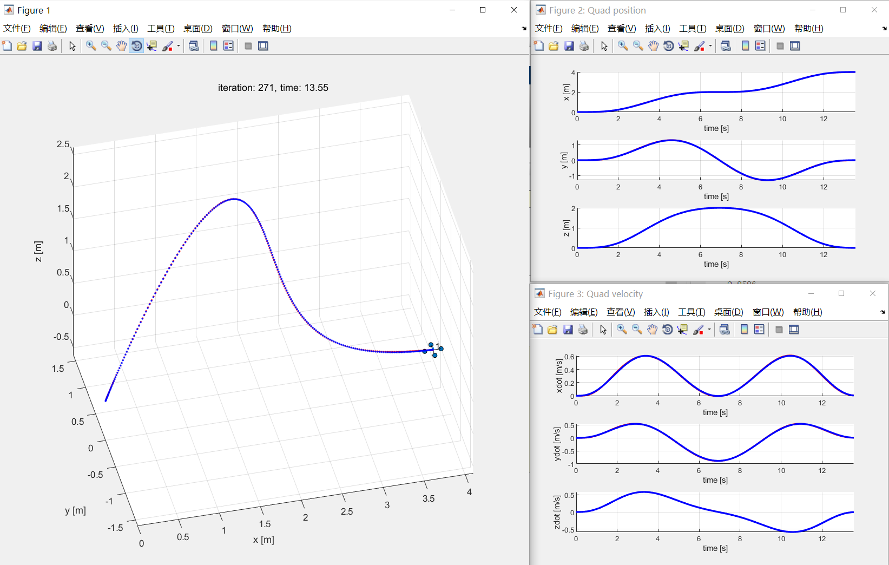
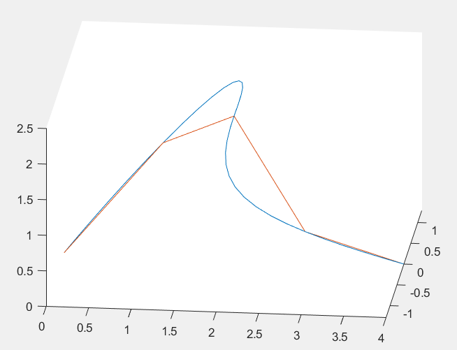
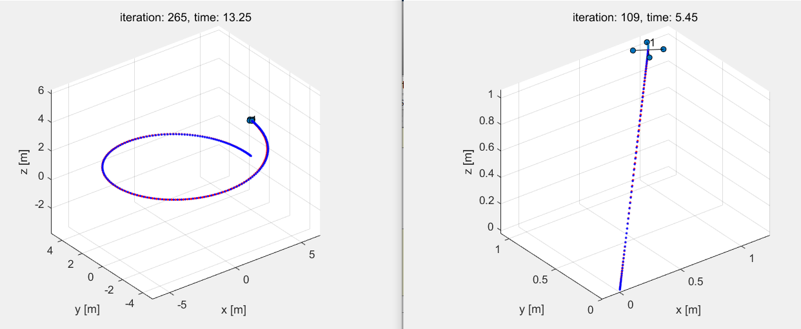
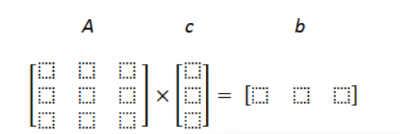

# Control-and-Trajectory-Planner-Simulator
This is the course work for Aerial Robotics in Coursera！

## Effect

The code is divided into three parts: 

1. 1-D controller for quadrotor
2. 2-D controller for quadrotor
3. 3-D controller and trajectory planner for quadrotor

I present the effect of 3-D controller and trajectory planner in the github.

### Trajectory planner and controller. 

Trajectory point: 

```matlab
waypoints = [0    0   0;
             1    1   1;
             2    0   2;
             3    -1  1;
             4    0   0]';
```



The trajectory generator：



### Test curve following performance 



## Usage

### runsim.m(start)

You can choose which trajectory to follow in simulation!  Run this script to run the simulation!

```Matlab
%% pre-calculated trajectories
trajhandle = @traj_line;
%trajhandle = @traj_helix;

%% Trajectory generation with waypoints
%% You need to implement this
% trajhandle = @traj_generator;
% waypoints = [0    0   0;
%              1    1   1;
%              2    0   2;
%              3    -1  1;
%              4    0   0]';
% trajhandle([],[],waypoints);
```

### traj_generator.m

In this file you can compute your own smooth trajectory for the quadrotor to follow! 

Note that the existed trajectory planner is to minimize the snap of quadrotor! To minimize the snap of quadrotor,  we must use a 7th order polynomial to represent each section of the desired trajectory. From the above waypoints,  we know that we have four section of trajectory.

> 1. [0 0 0] to [1 1 1]
> 2. [1 1 1] to [2 0 2]
> 3. [2 0 2] to [3 -1 1]
> 4. [3 -1 1] to [4 0 0]

First, we should consider the x-direction, the section is 0->1->2->3->4, we use four 7th order polynomial(which has eight parameters each) to represent each curve of x.  To solve the four eighth order polynomial, we must find 32 border as follows:

```matlab
1) P1(0) = W1; P2(0) = W2; P3(0) = W3; P4(0) = W4 - 4 equations

2) P1(1) = W2; P2(1) = W3; P3(1) = W4; P4(1) = W5 - 4 equations

3) P1_dot(0) = 0; P1_ddot(0) = 0; P1_dddot(0) = 0 - 3 equations

4) P4_dot(1) = 0; P4_ddot(1) = 0; P4_dddot(1) = 0 - 3 equations

5) P1_dot(1) = P2_dot(0) ; P2_dot(1) = P3_dot(0) ; P3_dot(1) = P4_dot(0) ;

P1_ddot(1) = P2_ddot(0) ; P2_ddot(1) = P3_ddot(0) ; P3_ddot(1) = P4_ddot(0) ;

....

P1_(6dot)(1) = P2_(6dot)(0) ; P2_(6dot)(1) = P3_(6dot)(0) ; P3_(6dot)(1) = P4_(6dot)(0) ;

\- 18 equations.
```


As a result, 4+4+3+3+18 = 32 equations. If you are strong and crazy enough, you can solve this system of equations by hand. And then do it 2 more times for Y and Z directions. In matlab we can calculated by matrix.



> Note: in the first row of A matrix the first 8 columns correspond to coefficients given by t=0 (in this equation it is 1 0 0 0 0 0 0 0 0). All the rest 24 columns are zero, because unknowns c21, c22, c23 ... c48 do not present in the first equation. Similarly in the seond row of A matrix the first 8 values are zeros, then 8 values from second equation, then 16 zeros till the end of row. In b vector the first value is 0 (given by W1_x from 1st equation), the second is 1 (given by W2_x from 2nd equation).
>
> You need to fill the **A** and **b** matrices in this manner for all 32 equations. Hint: the last 18 equations such as **P2_dot(1) = P3_dot(0)** can be written as **P2_dot(1) - P3_dot(0) = 0.**

In traj_generator.m, we use the following code to get 32 coefficients of x, y, and z direction,

```matlab
coffx = getCoff(waypoints0,1);
coffy = getCoff(waypoints0,2);
coffz = getCoff(waypoints0,3);
```

Let's take a look in getCoff, the 1,2,3 represent the x, y, z, it will take the 1,2,3 row to compute the coefficient

Please note the compute of rows and cols of  matrix can be easily confused, so be careful.

```matlab
function [coff, A, b] = getCoff(waypoints,axis)
waypoints = waypoints'
n = size(waypoints,1)-1; % number of segments P1..n
A = zeros(8*n, 8*n);
b = zeros(1,8*n);

% --------------------------------------------
% equations:

for i=1:n
    b(1,i) = waypoints(i,axis);        % b就是为结果值
end
for i=2:n+1
    b(1,n+i-1) = waypoints(i,axis);
end

row = 1;
for i=1:n
    A(row,8*(i-1)+1:8*i) = polyT(8,0,0);   % 8阶多项式，0阶导，t值等于0
    row = row + 1;
end
for i=1:n
    A(row,8*(i-1)+1:8*i) = polyT(8,0,1);   % 8阶多项式，0阶导，t值等于1
    row = row + 1;
end
for i=1:3
    A(row,1:8) = polyT(8,i,0);   % 8阶多项式，0阶导，t值等于0
    row = row + 1;
end
for i=1:3
    A(row,25:32) = polyT(8,i,1);   % 8阶多项式，i阶导，t值等于1
    row = row + 1;
end
for i=1:n-1
    A(row,8*(i-1)+1:8*(i)) = polyT(8,1,1); % 8阶多项式，1阶导，t值等于1
    A(row,8*(i)+1:8*(i+1)) = - polyT(8,1,0); % 8阶多项式，1阶导，t值等于0
    row = row + 1;
end
for i=1:n-1
    A(row,8*(i-1)+1:8*(i)) = polyT(8,2,1); % 8阶多项式，2阶导，t值等于1
    A(row,8*(i)+1:8*(i+1)) = - polyT(8,2,0); % 8阶多项式，2阶导，t值等于0
    row = row + 1;
end
for i=1:n-1
    A(row,8*(i-1)+1:8*(i)) = polyT(8,3,1); % 8阶多项式，3阶导，t值等于1
    A(row,8*(i)+1:8*(i+1)) = - polyT(8,3,0); % 8阶多项式，3阶导，t值等于0
    row = row + 1;
end
for i=1:n-1
    A(row,8*(i-1)+1:8*(i)) = polyT(8,4,1); % 8阶多项式，3阶导，t值等于1
    A(row,8*(i)+1:8*(i+1)) = - polyT(8,4,0); % 8阶多项式，3阶导，t值等于0
    row = row + 1;
end
for i=1:n-1
    A(row,8*(i-1)+1:8*(i)) = polyT(8,5,1); % 8阶多项式，3阶导，t值等于1
    A(row,8*(i)+1:8*(i+1)) = - polyT(8,5,0); % 8阶多项式，3阶导，t值等于0
    row = row + 1;
end
for i=1:n-1
    A(row,8*(i-1)+1:8*(i)) = polyT(8,6,1); % 8阶多项式，3阶导，t值等于1
    A(row,8*(i)+1:8*(i+1)) = - polyT(8,6,0); % 8阶多项式，3阶导，t值等于0
    row = row + 1;
end

% --------------------------------------------

coff = inv(A)*b';
end
```

The function polyT  will return the value of the derivative of polynomial. For example, polyT(8, 1, 2) represent the array value of the derivative of the following polynomial when t equals to 2.
$$
polyT(1 + t^{1}+ t^{2}+ t^{3}+ t^{4}+ t^{5}+ t^{6}+ t^{7}) = [0, 1, 4,12,32,80,192,448 ]
$$
Once we have compute the polynomial of each section with the t from[0-1],  we can compute the desired position, speed and acceleration of quadrotor from the 0,1,2nd derivative of this polynomial. Note that we uniform the time of each section to scale 1,  so when we compute the derivative of this polynomial, we must multiply a (1/scale)^n

```matlab
vel_x = caculate_poly(coffx(8*(t_index-2)+1:8*(t_index-1),1),scale,1)/d0(t_index-1);
vel_y = caculate_poly(coffy(8*(t_index-2)+1:8*(t_index-1),1),scale,1)/d0(t_index-1);
vel_z = caculate_poly(coffz(8*(t_index-2)+1:8*(t_index-1),1),scale,1)/d0(t_index-1);
        
acc_x = caculate_poly(coffx(8*(t_index-2)+1:8*(t_index-1),1),scale,2)/((d0(t_index-1))^2);
acc_y = caculate_poly(coffy(8*(t_index-2)+1:8*(t_index-1),1),scale,2)/((d0(t_index-1))^2);
acc_z = caculate_poly(coffz(8*(t_index-2)+1:8*(t_index-1),1),scale,2)/((d0(t_index-1))^2);
```

### controller.m

#### outer loop control of position

```matlab
% 外环pid控制
r_ddot_1_des = des_state.acc(1) + kd_1 * (des_state.vel(1) - state.vel(1)) + kp_1 * (des_state.pos(1) - state.pos(1) );
r_ddot_2_des = des_state.acc(2) + kd_2 * (des_state.vel(2) - state.vel(2)) + kp_2 * (des_state.pos(2) - state.pos(2) );
r_ddot_3_des = des_state.acc(3) + kd_3 * (des_state.vel(3) - state.vel(3)) + kp_3 * (des_state.pos(3) - state.pos(3) );
```

then we can simply compute u1(the vertical force) by：

```matlab
% u1 直接计算
u1 = params.mass * params.gravity + params.mass * r_ddot_3_des;
```

according to the desired acc of x-direction and y-direction, we compute the desired rotation:

```matlab
phi_des = (1/params.gravity) *(r_ddot_1_des * sin(des_state.yaw) - r_ddot_2_des * cos(des_state.yaw));
theta_des = (1/params.gravity) * (r_ddot_1_des * cos(des_state.yaw) + r_ddot_2_des * sin(des_state.yaw));
psi_des = des_state.yaw;
```

then we use another PD controller to control the rotation:

```matlab
%角度环控制
u_phi = kp_phi * (phi_des - state.rot(1)) + kd_phi * (0 - state.omega(1));
u_theta = kp_theta * (theta_des - state.rot(2)) + kd_theta * (0 - state.omega(2));
u_psi = kp_psi * (psi_des - state.rot(3)) + kd_psi * (des_state.yawdot - state.omega(3));
%计算thrust和moment
F = u1;
M = params.I * [u_phi;u_theta;u_psi];
```

